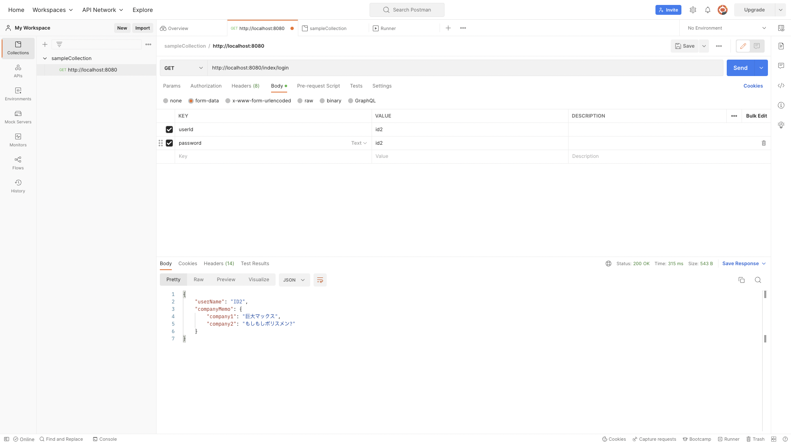
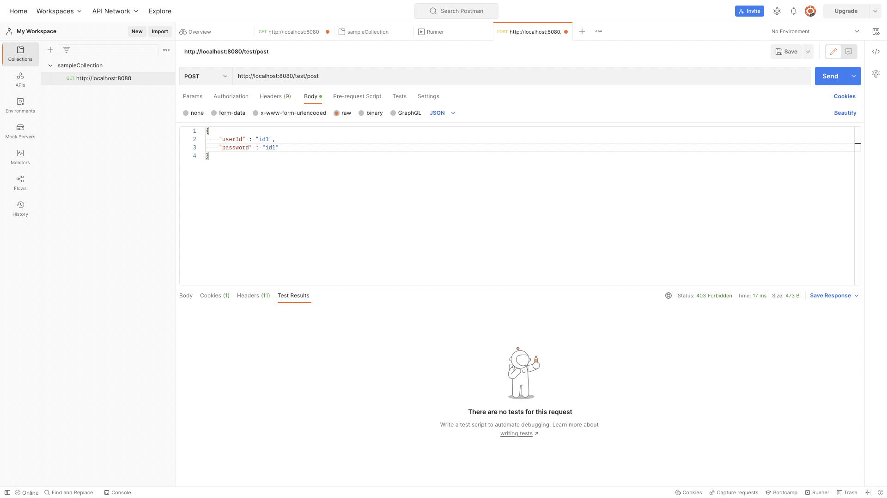

# POSTMANを使ったバックエンド側のテスト方法について

POSTMANというアプリを使ってGETリクエストやPOSTリクエストを送信する方法を記載。

 

## インストール

以下サイトの方法でインストールを行う。

簡単な使い方も記載されている。

[PostmanでAPIテスト | エンジニアBLOG ](https://cloudsmith.co.jp/blog/efficient/2021/08/1837085.html)

 

## 使い方

### GETメソッド

送信するURLを入力(基本的にSpringbootは8080番で開けてるのでhttp://localhost:8080にリクエストパラメータを足せばOK)

画面左上のメソッドを選択する部分でGETメソッドを選択

Body、form-dataを選択

画像のように送信したいパラメータの名前とその値をkeyとvalueに入力

画面右上のsendを押すとレスポンスが画面した部分に表示される

 

### POSTメソッド

送信するURLを入力(基本的にSpringbootは8080番で開けてるのでhttp://localhost:8080にリクエストパラメータを足せばOK)

画面左上のメソッドを選択する部分でPOSTメソッドを選択

Body、rawを選択し、textをjsonに変更する

画像のように送信したい内容をjson形式で入力

画面右上のsendを押すとレスポンスが画面した部分に表示される

詳しい操作方法はこちらを参照

[【Postman入門】RestAPIテストで必須なツールのPostmanの使い方を基礎からマスターしよう！ ](https://www.youtube.com/watch?v=Z6-jgPbiX1E&t=829s)